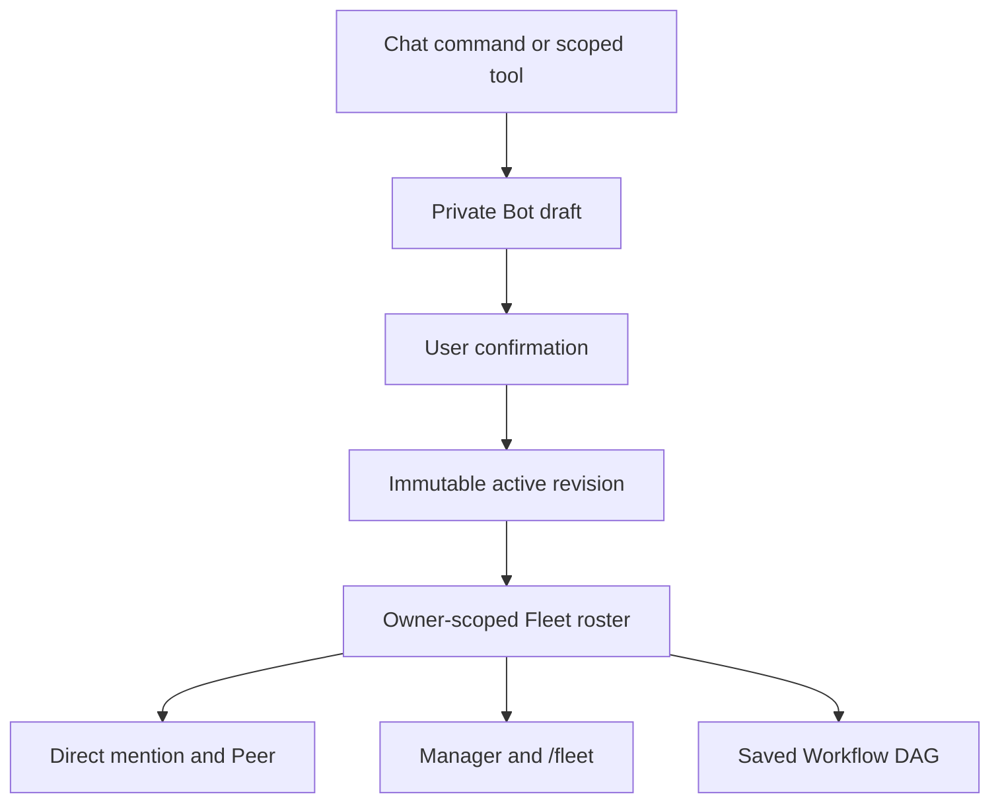
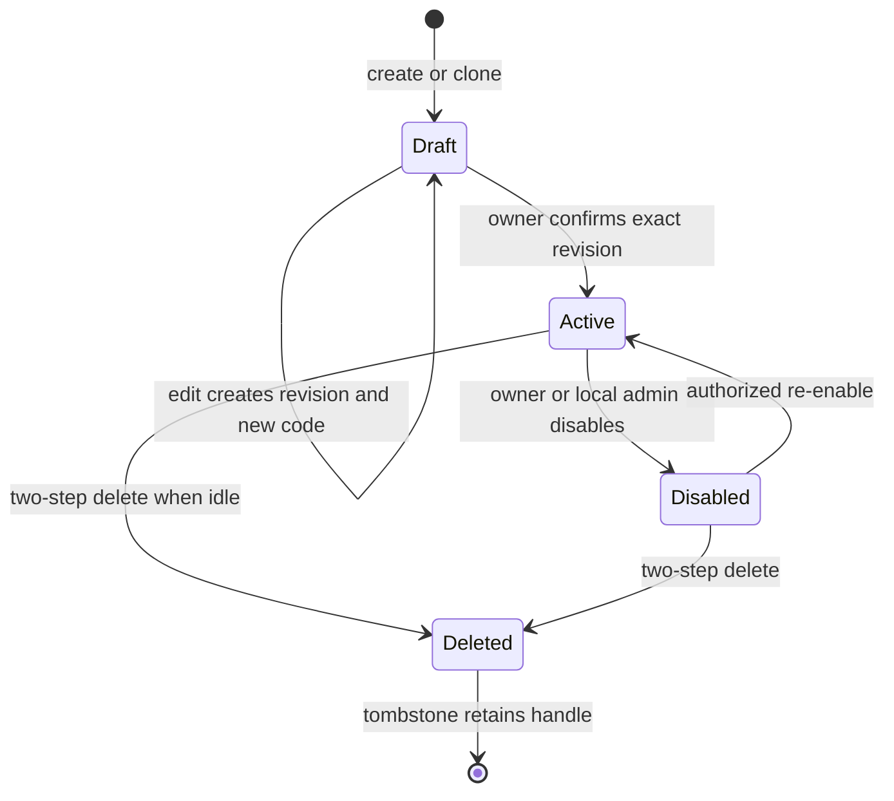

# Dynamic Bot Fleet v1: Architecture, Rollout, and Long-Running Plan

## Status

This document describes the integrated implementation branch that combines the dynamic Bot Registry work from PR #10 with the durable Workflow Task DAG work from PR #15, plus the fixes and end-to-end coverage required for automatic Fleet enrollment.

The implemented product path is:

1. A user creates a private Bot draft in chat or through the scoped `bot_create_draft` tool.
2. The user reviews the immutable revision and confirms its eight-character activation code.
3. The Registry activates that exact revision.
4. The Gateway projects the active revision into the owner-scoped runtime directory.
5. The Bot is immediately eligible for direct `@bot` routing, `/fleet` planning, `@manager` delegation, enabled Peer Messaging, and enabled saved Workflow capability selection.
6. The same Fleet membership is reconstructed from local durable state after restart.

As of main after PR #18, the local console and owner chat also expose Fleet membership reason, bounded active-Run health, recent failure context, and roster filters. This is a complete single-node dynamic-enrollment path. It is not a claim that the project already provides xAI's unpublished infrastructure, hundreds of simultaneous model sessions, or distributed execution.

## Architecture



The Registry is the source of truth. The runtime roster is a rebuildable projection, not a second writable database. This avoids a dual-write transaction between “activation” and “Fleet membership.” Activation succeeds only when the Gateway can produce and verify the expected runtime projection.

### Fleet roster versus Team membership

Automatic enrollment means joining the owner's logical Fleet roster. It does not automatically add the Bot to every `TeamDefinition`.

- A Fleet roster is the capability directory from which routing and planning select authorized Bots. It can contain hundreds of logical Bots.
- A Team is a task-specific, bounded governance object with a manager, membership revision, and concurrency limit. A Team currently allows at most six members.

Automatically inserting every new Bot into every Team would silently widen permissions and break Team concurrency bounds. Team membership therefore remains explicit.

## Activation state machine



Important invariants:

- A model may create or update a draft, but cannot choose the owner, ACL principal, session identity, or approve itself.
- A confirmation code is bound to definition version, revision number, and content fingerprint. Editing invalidates the previous code.
- Active user-scoped Bots receive an owner principal such as `user:feishu:ou_x`; another platform or user with the same raw ID is not equivalent.
- Static profiles, dynamic definitions, and deleted tombstones share one handle namespace.
- Manager-role dynamic Bots and scopes that cannot be enforced safely are not projected into the runtime.
- Disable and delete fail closed while the Bot has active or queued work.

## Feature gates

All Fleet v2 gates remain `false` by default and are enforced at their execution entrypoints.

| Gate | Effect when enabled | Current product surface |
| --- | --- | --- |
| `dynamicRegistry` | Loads active Registry revisions into the runtime directory | Local settings page |
| `chatBotCreation` | Enables chat commands and scoped draft tools | Local settings page; requires `dynamicRegistry` |
| `peerMessaging` | Allows a Bot to route bounded authorized `@bot` output and typed Bot-originated messages | Local settings page |
| `managerAgent` | Enables user-originated `@manager` plans and bounded delegation | Local settings page |
| `savedWorkflows` | Enables versioned Workflow store and Task DAG launch APIs | Local settings page; editor remains future work |
| `externalRuntimes` | Reserved for Hermes/Grok runtime adapters | Not exposed because the adapter is not implemented |

Disabling a gate blocks new admissions. Durable Workflow work already admitted under a pinned immutable revision may finish recovery so that a rollback does not strand tasks in an unresolvable state.

## User flow

Enable Bot Fleet, Dynamic Bot Registry, and Chat Bot Creation in the local settings page, save, then start a fresh chat session:

```text
/new
/bot create analyst Data Analyst
/bot edit analyst capabilities analysis,research
/bot confirm ABCD2345
```

On success, the confirmation response states that `@analyst` joined the owner's Fleet roster. It can then be used through:

```text
@analyst Analyze this dataset
@manager Delegate an analysis task to the best authorized Bot
/fleet Research, verify, and summarize this topic
```

If Peer Messaging is enabled, a direct Bot result containing an authorized `@reviewer` can create a bounded child Task/Run. Unknown targets, self mentions, visited Bots, exhausted hop budgets, approval-required targets, and unauthorized targets do not route.

## Persistence and privacy

User runtime state remains local under `${DSH_HOME:-~/.dsh}/hermes-bot/`:

```text
state.json
pairing.json
inbound-wal.jsonl
outbox.jsonl
mailbox.jsonl
tasks.jsonl
workflows.jsonl
rooms.json
approvals.json
bot-registry.jsonl
teams.jsonl
```

These files may contain user instructions, model output, ownership metadata, or audit records. They must not be committed to Git, copied into documentation, or uploaded to a shared cloud drive by the product.

Google Drive is only for large development artifacts such as disposable stress logs, research corpora, or benchmark archives. It is not a runtime database, lock service, recovery source, or default user-storage destination. Small source-controlled test summaries and manifests stay in Git; secrets and production transcripts stay out of both locations.

## Implemented capability matrix

| Capability | Status | Notes |
| --- | --- | --- |
| Chat create/edit/clone/confirm/disable/enable/delete | Implemented | Draft-first and owner-confirmed |
| Automatic Fleet enrollment | Implemented | Owner-scoped runtime projection with status and audit |\n| Fleet health projection and roster filters | Implemented | Membership reason, bounded active Runs, latest failure, and local-console filters |
| Direct dynamic `@bot` invocation | Implemented | Uses the same Task/Run/Mailbox path as static Bots |
| Dynamic Bot to authorized Bot `@mention` | Implemented behind gate | TTL, hop, visited, ACL, approval, idempotency, and size bounds |
| User `@manager` planning | Implemented behind gate | Deterministic policy; plan first, then bounded dispatch |
| `/fleet` selection of dynamic Bots | Implemented | Capability and ACL aware |
| Versioned saved Workflow definitions | Implemented behind gate | Immutable revisions, validation, import/export |
| Durable task-node DAG continuation | Implemented subset | Task nodes, dependency outputs, concurrency/fan-out, restart recovery |
| Full condition/map/reduce/approval/compensation execution | Not complete | Schema exists; runtime adapters remain future work |
| Team-wide `@team` routing | Not complete | Parser and durable Team data exist; Router integration remains future work |
| 500 logical Bot roster | Data-path tested | Not 500 simultaneous model sessions |
| Distributed workers and cross-machine transport | Not implemented | Single-node runtime only |

## Verification gates

The integration must pass all of the following before merge:

1. TypeScript strict check.
2. Complete Node test suite without real API keys.
3. Client bundle build.
4. Package dry run and tarball smoke installation.
5. Dynamic Bot end-to-end test covering create, edit, stale-code rejection, confirmation, roster enrollment, ACL isolation, direct invocation, Peer routing, Manager selection, Workflow selection, and restart recovery.
6. A pure-data test loading 500 owner-scoped logical Bots and selecting the final capability.
7. Feature-gate tests proving Manager, Peer, and saved Workflow effects remain off by default.
8. Repeated fault/recovery runs for Workflow terminal delivery ordering.
9. Secret and runtime-state diff scan.

## Safe rollout and migration

### Stage 1: merge gate

1. Review the integration diff against `main`, not only against PR #10 or PR #15.
2. Require green CI for TypeScript, complete tests, client build, and package checks.
3. Keep the old PRs unmerged if the integration PR supersedes them; do not merge overlapping stacks independently.
4. Merge the integration PR only after required checks and review threads are resolved.

Rollback: revert the integration merge. Existing append-only state remains on disk and is ignored by older code; keep a backup before downgrading.

### Stage 2: dark launch

1. Deploy with all Fleet v2 feature gates disabled.
2. Verify Telegram/Feishu ingress, allowlist, pairing, static Bots, WAL, Outbox, and `/status` behavior.
3. Confirm no unexpected Registry projection or Manager/Peer/Workflow admission occurs.

Rollback: redeploy the prior bundle. No user migration has occurred.

### Stage 3: single-owner canary

1. Enable `dynamicRegistry` and `chatBotCreation` for a controlled local instance.
2. Create one Bot, edit it once, verify the old code fails, confirm the new code, and inspect `fleetMembership=joined`.
3. Invoke the Bot directly and restart the plugin.
4. Verify another user cannot list or invoke the Bot.

Rollback: disable chat creation first; then disable the Bot after active work drains. Do not delete state merely to roll back code.

### Stage 4: bounded collaboration canary

1. Enable `peerMessaging` with low hop, fan-out, message, and concurrency limits.
2. Enable `managerAgent` with approval mode `auto-planned` or stricter.
3. Test one dynamic worker and one static verifier.
4. Review audit reasons for denied ACL, approval, loop, and budget cases.

Rollback: disable Manager and Peer admission independently. Existing claimed work completes or is cancelled through normal Task controls.

### Stage 5: saved Workflow canary

1. Enable `savedWorkflows` only for validated task-node DAGs.
2. Pin every launch to an immutable revision and explicit launch ID.
3. Exercise restart at Task creation, Mailbox enqueue, Run completion, result Outbox enqueue, and root terminal transition boundaries.

Rollback: disable new Workflow admission. Let already-admitted pinned revisions recover to a terminal state.

## Long-running development plan

### Phase A — Product hardening

Progress on main: PR #18 delivered membership reasons, bounded Bot activity and failure projection, roster filters, and owner-facing `/bot status <id>`. Remaining Phase A work is explicit Team membership commands, complete help/setup gate explanations, and manual Feishu/Telegram acceptance.

Deliverables:

- Chat help and setup UX for every implemented gate.
- Fleet roster filters, membership reason, revision, owner scope, busy state, and last failure.
- Explicit Team add/remove commands rather than implicit Team widening.
- Manual Feishu and Telegram acceptance checklist.

Exit gate: a new user can create, confirm, invoke, disable, and recover a Bot without editing JSON configuration.

### Phase B — Manager runtime v2

Steps:

1. Add scoped Manager tools for observing eligible Bots and Task state.
2. Compile every delegation into typed intent; never allow a model to submit requester, task identity, ACL, or reply target.
3. Add bounded wait, timeout, low-confidence, unavailable-Bot, and replan transitions.
4. Add approval checkpoints for external side effects, high risk, or budget expansion.
5. Persist plan revisions and evidence references.

Exit gate: kill/restart at every Manager state transition and obtain one idempotent terminal result without privilege widening.

### Phase C — Workflow runtime completeness

Steps:

1. Implement runtime adapters for condition and approval nodes.
2. Implement bounded map/fan-out and deterministic reduce.
3. Add timeout, retry policy, compensation, and side-effect declarations.
4. Validate all input/output references at compile time and again at dispatch.
5. Build a draft/review/activate Workflow UI without accepting JavaScript or shell nodes.

Exit gate: every schema node either has a tested runtime adapter or is rejected before launch with a stable diagnostic code.

### Phase D — Team and Thread collaboration

Steps:

1. Connect `@team` to a canonical Team/Thread Router.
2. Enforce membership revision, manager identity, concurrency, TTL, hop, and message budget at every hop.
3. Add explicit join/leave invitations and approvals.
4. Preserve correlation and reply chains across restarts.
5. Add artifact references with local permission checks; do not copy credentials or arbitrary file contents into Team state.

Exit gate: no user, chat, workspace, or Team boundary can be crossed by replaying a valid message from another scope.

### Phase E — Large logical fleets

Steps:

1. Replace full roster scans with capability and owner indexes.
2. Introduce a bounded worker pool, per-owner quotas, backpressure, and admission queues.
3. Lazy-create Agent sessions and evict idle sessions without deleting Bot definitions.
4. Add token, message, cost, and concurrency telemetry.
5. Stress 100, 500, and 1,000 logical Bots while holding simultaneous model sessions to configured limits.

Exit gate: roster size does not imply unbounded memory, model sessions, network calls, or execution fan-out.

### Phase F — Distributed transport

Steps:

1. Define a transport-neutral envelope and worker capability lease.
2. Add durable queue transport with ownership, lease renewal, fencing, and idempotent result commit.
3. Preserve owner ACL and approval decisions at the receiving worker.
4. Add partition, duplication, reordering, clock-skew, and worker-loss tests.
5. Keep local transport as the default and rollback path.

Exit gate: a stale or partitioned worker cannot commit after its fencing token is superseded.

### Phase G — Hermes and Grok adapters

Steps:

1. Freeze a runtime adapter interface: create/resume, send, steer, stop, inspect, and list sessions.
2. Keep Gateway identity, ACL, approval, Mailbox, and audit authoritative.
3. Implement Hermes mapping first using public APIs and fixtures.
4. Implement a Grok adapter only for documented public interfaces; do not infer or claim unpublished internals.
5. Run contract tests against each adapter and retain the DSH adapter as the stable default.

Exit gate: switching a runtime adapter cannot change authorization or durable message semantics.

### Phase H — Operations and release

Steps:

1. Add SLOs for queue age, completion latency, retry rate, dead letters, stale events, and approval expiry.
2. Add bounded audit search and privacy-safe export.
3. Add state schema migration, backup, restore, and downgrade rehearsal.
4. Add canary release, automatic health rollback, and incident runbooks.
5. Publish only measured capacity claims.

Exit gate: operators can detect, contain, recover, and explain a failed Fleet run without reading secrets or raw unrelated conversations.

---

# 动态 Bot Fleet v1：架构、上线与长期计划

## 当前结论

当前集成方案已经打通“聊天创建草稿 → 用户确认 → 激活不可变 Revision → 自动投影到用户私有 Fleet roster → 参与直接调用、Peer、Manager、`/fleet` 和 Workflow → 重启恢复”的单机完整链路。PR #18 又补充了加入原因、忙碌 Run、最近失败信息、Roster 筛选和聊天 `/bot status <id>`，使用户可以直接核实 Fleet 状态。

这里的“自动加入 Fleet”不是把 Bot 强制加入所有 Team，而是加入该所有者可见、受 ACL 约束的逻辑 Bot 目录。Team 是最多六名成员的任务治理对象，仍需显式维护；这样不会因为创建一个 Bot 而偷偷扩大既有 Team 的权限和并发范围。

## 已实现的核心保证

- 聊天命令和普通 Agent Tool 只能创建或修改草稿，不能自行激活。
- 八位确认码绑定 definition version、revision 和内容指纹；修改后旧码失效。
- 激活后 Gateway 必须验证动态运行时投影确实存在，才向用户报告“已自动加入 Fleet”。
- 用户作用域使用带平台的 owner principal，不会把不同平台的相同 UID 当作同一个身份。
- 动态 Bot 与静态 Bot、删除墓碑共享 handle 命名空间。
- 停用或删除前检查活动 Task、Run、Mailbox、Workflow、Handoff、Room 和直接 Agent 会话。
- Registry 是事实源，Fleet roster 是可重建投影；重启后从本机状态恢复，不依赖 Google Drive。
- `peerMessaging`、`managerAgent`、`savedWorkflows` 现在在真实执行入口检查，默认关闭时不会产生对应副作用。
- Workflow 最终结果先进入幂等 Outbox，再写 root terminal 状态，避免“状态已完成但用户永远收不到结果”的崩溃窗口。

## 推荐启用顺序

1. 先只部署代码，保持全部 Fleet v2 开关关闭，验证原有聊天、配对、静态 Bot、WAL 和 Outbox。
2. 小范围开启 `dynamicRegistry` 与 `chatBotCreation`，完成创建、修改、旧码拒绝、确认、ACL 和重启测试。
3. 低预算开启 `peerMessaging`，验证越权、循环、hop、TTL、审批和幂等限制。
4. 开启 `managerAgent`，保留 `auto-planned` 或更严格审批策略。
5. 最后只对经过验证的 task-node DAG 开启 `savedWorkflows`。
6. `externalRuntimes` 继续关闭，直到 Hermes/Grok Adapter 有公开接口契约和完整测试。

## 长期执行原则

- 每个阶段独立功能开关、独立迁移、独立回滚。
- 所有执行都走 Gateway 推导的身份、ACL、审批、Task/Run、Mailbox 和 fencing，不信任模型提供的身份字段。
- “500 Bot”目前只代表 500 个逻辑定义和 roster 查询测试，不代表 500 个模型会话并发。
- 大型开发压测日志或研究资料可以放指定 Google Drive；用户运行时数据始终只保存在本机。
- 只有完整条件/映射/归约/补偿节点、Team Router、分布式 Transport 和运行时 Adapter 逐项通过故障测试后，才能把产品描述为更完整的动态 Agent Network。

## 长期阶段和详细步骤

### A. 产品收口

1. 在帮助、设置页和状态页完整显示动态 Bot 创建条件、Revision、Fleet membership、阻塞原因、繁忙状态和失败原因。
2. 增加显式 Team 加入/移除命令，不把 roster 自动加入误解为 Team 自动扩权。
3. 分别完成飞书和 Telegram 的人工验收：创建、修改、旧码拒绝、确认、调用、停用、重启恢复。
4. 对 UI 保存、Gateway 重载和 Registry 修改做并发测试。

验收门：新用户不编辑 JSON，也能完成动态 Bot 的完整生命周期；任一失败都能看到可操作的原因。

### B. Manager Runtime v2

1. 增加只读观察 Bot、Task、Run、预算和可用状态的 Manager Tool。
2. 所有委派先输出结构化 plan revision 与 delegation intent，再由 Gateway 补全真实 requester、taskId、runId 和 reply target。
3. 增加 unavailable、timeout、failed、low-confidence 的有限重试与 replan 状态。
4. 高风险、外部副作用或预算扩大必须停在审批节点。
5. 重启每个状态边界，验证只产生一次最终副作用。

验收门：Manager 能重新规划但不能修改 ACL、密钥、Bot 生命周期或替用户批准。

### C. Workflow 运行时补全

1. 实现 condition 与 approval Adapter。
2. 实现有界 map/fan-out 和确定性 reduce。
3. 实现 timeout、retry、compensation 与外部副作用声明。
4. 编译和派发时双重验证 input/output 引用、capability、权限和预算。
5. 增加只生成声明式 DAG 的草稿/审查/激活 UI，继续拒绝任意 JavaScript 和 Shell。

验收门：Schema 中每类节点要么有故障测试覆盖的 Adapter，要么在启动前返回稳定错误码，不能静默跳过。

### D. Team 与 Thread Router

1. 把 `@team` 接到 canonical Team/Thread。
2. 每一跳检查成员 Revision、manager 身份、ACL、并发、TTL、hop 和消息预算。
3. 增加显式邀请、加入、移除和审批。
4. 重启后保持 correlation/reply 链和 Artifact Reference。
5. Artifact 只保存引用并检查本地权限，不把凭据和任意文件正文写入 Team State。

验收门：把另一用户、聊天、Workspace 或 Team 的合法消息重放到当前作用域时，也不能越界。

### E. 大规模逻辑 Fleet

1. 为 owner、scope、capability 和状态建立索引，避免全量 roster 扫描。
2. 引入有界 Worker Pool、每所有者配额、背压和 admission queue。
3. 延迟创建 Agent Session，并安全回收空闲 Session，不删除 Bot Definition。
4. 增加 token、消息、成本、队列年龄和并发指标。
5. 分别压测 100、500、1,000 个逻辑 Bot，同时把真实模型会话限制在配置范围。

验收门：Bot 定义数量增加不能线性放大模型调用、并发会话或执行 fan-out。

### F. 分布式执行

1. 冻结跨进程 Envelope 与 Worker capability lease。
2. 实现 durable queue、租约续期、fencing 和幂等结果提交。
3. 接收 Worker 必须重新执行 owner ACL 和审批裁决。
4. 覆盖网络分区、重复、乱序、时钟偏差和 Worker 丢失测试。
5. 本地单机 Transport 始终保留为默认和回滚路径。

验收门：旧 Worker 的 fencing token 被替换后，无论迟到多久都不能提交结果。

### G. Hermes/Grok Runtime Adapter

1. 冻结 `create/resume`、`send`、`steer`、`stop`、`inspect`、`listSessions` 接口。
2. 身份、ACL、审批、Mailbox 和 Audit 继续由 DeepSeek-Bot Gateway 统一治理。
3. 先基于公开接口实现 Hermes Adapter 和契约测试。
4. Grok Adapter 只使用官方公开接口，不猜测或宣传未公开内部实现。
5. DSH Adapter 保持稳定默认，可逐个 Bot 回退。

验收门：切换 Runtime 不得改变授权结果、幂等键或消息状态机语义。

### H. 运维和发布

1. 建立队列年龄、完成延迟、重试、dead-letter、stale event 和审批过期 SLO。
2. 提供有界、隐私安全的审计查询与导出。
3. 演练状态 Schema 迁移、备份、恢复和降级。
4. 使用 canary 发布、健康检查和自动回滚。
5. 只发布经过测量的容量数据，不把逻辑 Bot 数写成模型并发数。

验收门：运维人员不读取密钥或无关用户全文，也能定位、隔离、恢复并解释一次 Fleet 故障。

## 每次发布的固定检查

1. `npm run check`。
2. `npm test`。
3. `npm run build:client`。
4. `npm run pack:check` 和 `npm run pack:smoke`。
5. 完整测试连续运行至少三次。
6. 动态 Bot E2E、重启恢复、500 Bot 逻辑 roster 压测和 feature flag 默认关闭测试。
7. 检查 Git diff、打包清单和状态目录，确保没有 Secret、Token、Cookie、`.env`、运行时 JSONL 或用户 transcript。
8. 只有 required checks 和审查线程全部通过才合并；重叠的旧 PR 由新的集成 PR 取代，不分别重复合并。
